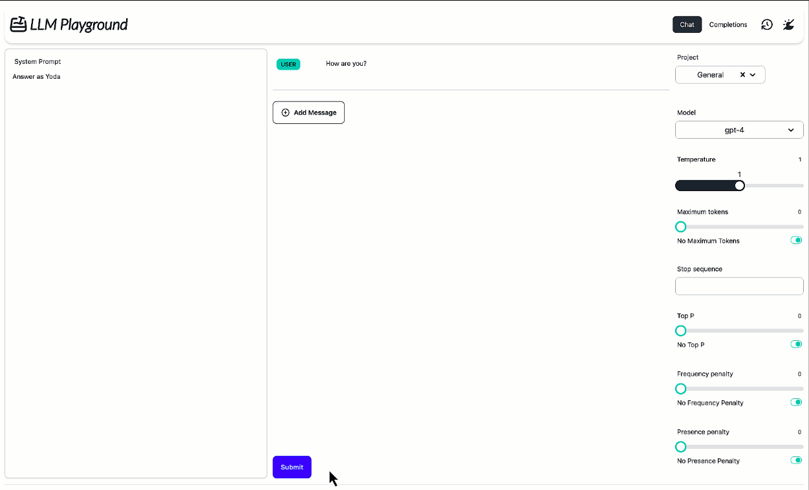

<h1><picture>
  <source media="(prefers-color-scheme: dark)" srcset=".github/logo-light.svg">
  
</picture></h1>

LLM Playground is a versatile environment for experimenting with different large language models (LLMs). It facilitates basic evaluation and comparisons directly in your browser, without the need to set up projects or write code in Jupyter notebooks. This tool supports a variety of LLMs, including OpenAI models, through configurable endpoints.

<picture>
  <source media="(prefers-color-scheme: dark)" srcset="./.github/screencast-dark.gif">
  
</picture>

## Features

- **Flexible Configuration**: Use environmental variables, a settings YAML file, or a `.env` file.
- **Support for Multiple Vendors**: Compatible with OpenAI protocol (you can configure other providers by setting up an [LiteLLM Proxy](https://docs.litellm.ai/docs/simple_proxy)).
- **Easy to Use**: Designed for straightforward setup and minimal overhead.
- **Rate experiments**: Compare different experiments by categorizing them and rating their performance.

## Getting Started

### Prerequisites

- Docker installed on your machine.

### Installation

To get started with LLM Playground, you can use Docker to pull and run the container:

```bash
docker pull ghcr.io/almogbaku/llm-playground
docker run -p 8080:8080 ghcr.io/almogbaku/llm-playground
```

This will start the LLM Playground on port 8080.

## Configuration

LLM Playground allows various configuration methods including environment variables, a `.env` file, or a `settings.yml` file.

### Configuration Options

- `openai_api_key`: Your OpenAI API key.
- `openai_organization`: Your OpenAI organization ID.
- `openai_base_url`: Base URL for the OpenAI API.
- `models`: Configuration for the models and endpoints.

### Models Configuration

Configure your models using one of the following methods:

1. **Direct Configuration**: Specify models directly in the `models.models` parameter.
2. **API Provider URLs**: Set `models.urls` to fetch models from an LLM-Playground compatible API ([GET request that returns an array of Model](server/src/protocol.py#L8)).
3. **OpenAI API URLs**: Set `models.oai_urls` to fetch models from an OpenAI compatible API.

Each model can be configured with a `base_url` if it does not utilize OpenAI or is not fetched from `models.oai_urls`.

### Example Configuration

Here is a more detailed example using an environment variable setup:

```bash
export OPENAI_API_KEY="your-openai-api-key"

export MODELS_MODELS_0_NAME="LLama3"
export MODELS_MODELS_0_DESCRIPTION="Facebook's Llama3 Model"
export MODELS_MODELS_0_TYPE="chat"
export MODELS_MODELS_0_MAX_TOKENS="32000"
export MODELS_MODELS_0_VENDOR="Facebook"
```

For multiple models, repeat the pattern adjusting the `MODEL_#_` prefix.

### YAML Configuration Example

```yaml
openai_api_key: "your-openai-api-key"
models:
  urls: ["http://example.com/api/models"] # Fetch models from an LLM-Playground compatible API
  oai_urls: ["http://example.com/api/openai-models"] # Fetch models from an OpenAI compatible API
  models:
    - name: "llama3"
      description: "Facebook's Llama3 Model"
      type: "chat"
      base_url: "https://api.example.com"
      max_tokens: 32000
      vendor: "Facebook"
```

## Usage

Once deployed, access LLM Playground by visiting `http://localhost:8080`. Choose from the available models to start your experiments and comparisons.
